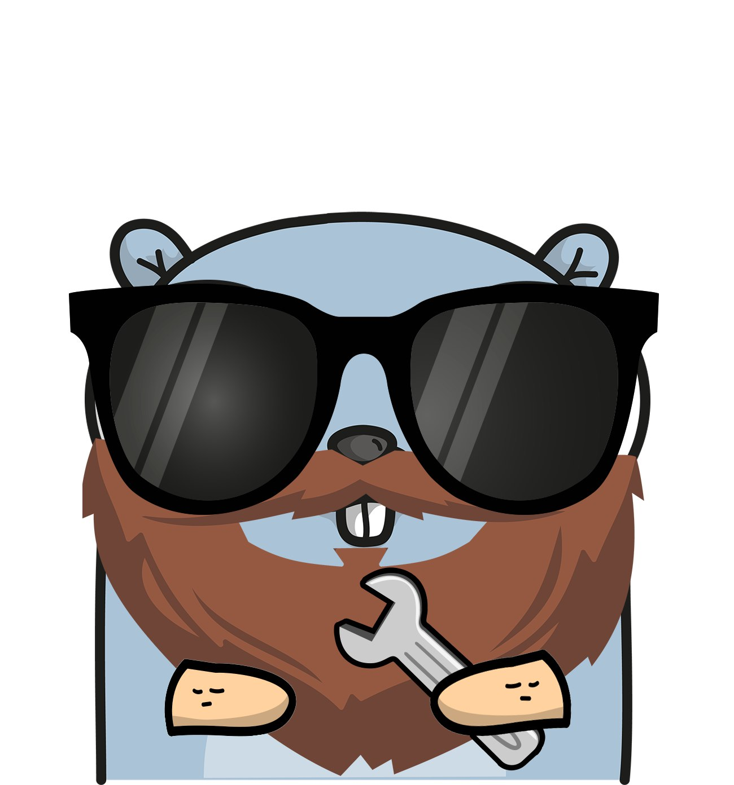

# Pandati

    
## The one stop shop for most common Go functions

  

## Table of contents

- [Pandati](#pandati)
  - [The one stop shop for most common Go functions](#the-one-stop-shop-for-most-common-go-functions)
  - [Table of contents](#table-of-contents)
    - [Purpose of the project](#purpose-of-the-project)
    - [Available helpers](#available-helpers)
    - [Contributing](#contributing)
    - [Name of the project](#name-of-the-project)

### Purpose of the project

Keeping things DRY for your projects. Set of most popular and frequently used helper functions making it easier to focus on the logic you want to implement rather than re-inventing the wheel ( and spending precious time going through StackOverflow ).

### Available helpers

| Class | Function | Description |
| :---  | :---  | :--- |
| Errors | `CheckForError(err error, msg ...string) (string)` | Checks for error and returns pre-formatted message with stack trace |
| Errors | `Trace() string` | Returns a formatted stack trace |
|  |  |  |
| Slices | `ExistsInSlice(slice interface{}, value interface{}) bool` | Checks if value exists in slice |
| Slices | `RemoveFromSlice(slice interface{}, value interface{})` | Removes value from slice |
| Slices | `RemoveFromSliceByIndex(slice interface{}, index int)` | Removes value from slice by index |
|  |  |  |
| Checks | `IsZero(v interface{}) bool` | Checks if value of anything passed is zero / empty / nil |

### Contributing

If you have any suggestions or want to contribute to the project, please open an issue or create a pull request.
Pull requests should contain test cases and documentation describing the added functionality.

### Name of the project

It's one of the sweet names I use to call my wife. She's always full of ideas and able to help with absolutely everything.
